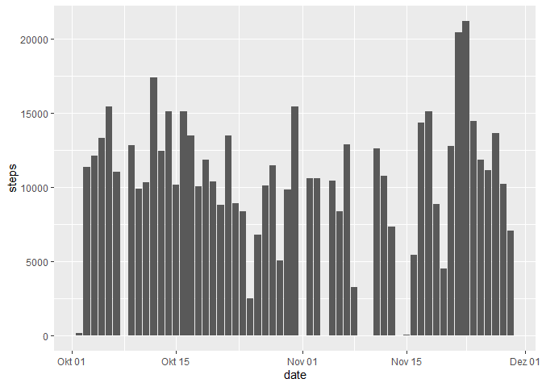
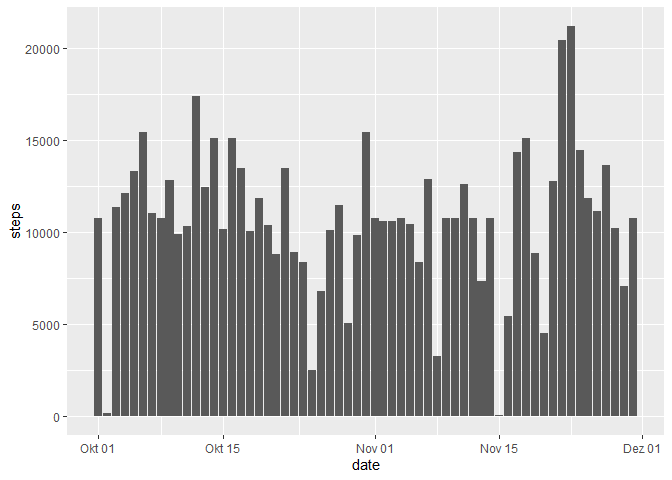
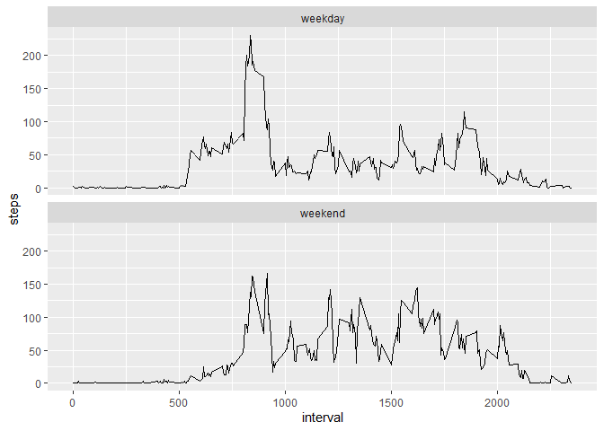

--- 
title: "PA1_template" 
output: 
  html_document: 
    keep_md: true 
---

## Reproducible Research Course Project 1

This assignment makes use of data from a personal activity monitoring device. This device collects data at 5 minute intervals through out the day. The data consists of two months of data from an anonymous individual collected during the months of October and November, 2012 and include the number of steps taken in 5 minute intervals each day.

The variables included in this dataset are:

- **steps**: Number of steps taking in a 5-minute interval (missing values are coded as \color{red}{\verb|NA|}NA)

- **date**: The date on which the measurement was taken in YYYY-MM-DD format

- **interval**: Identifier for the 5-minute interval in which measurement was taken

The dataset is stored in a comma-separated-value (CSV) file and there are a total of 17,568 observations in this dataset.

This assignment answers the following questions:

1. What is mean total number of steps taken per day?
2. What is the average daily activity pattern?
3. Imputing missing values
4. Are there differences in activity patterns between weekdays and weekends?

## What is mean total number of steps taken per day?

First, we load the packages and read the dataset *activity.csv*. 


```r
library(ggplot2)
library(dplyr)
```

```
## 
## Attaching package: 'dplyr'
```

```
## The following objects are masked from 'package:stats':
## 
##     filter, lag
```

```
## The following objects are masked from 'package:base':
## 
##     intersect, setdiff, setequal, union
```

```r
directory <- "./repdata_data_activity/activity.csv"

data <- read.csv(directory, header = T)
```
The format of the *date* and *steps* variables are changed to date and numeric as 
follows:


```r
data$date <- as.Date(data$date)
data$steps <- as.numeric(data$steps)
```
## What is mean total number of steps taken per day?

First, we calculate the total number of steps taken per day


```r
steps_t <- aggregate(steps ~ date, data, sum)
```
Below you can see the histogram showing the total number of steps taken per day 

```r
ggplot(steps_t, aes(x=date, y=steps)) + geom_bar(stat = "identity")
```

<!-- -->

Using the information in *steps_t*, the *mean* and *median* of the total number 
of steps taken per day are computed as:


```r
steps_t_mean <- mean(steps_t$steps)
steps_t_median <- median(steps_t$steps)
```

which result to be 1.0766189\times 10^{4} and 1.0765\times 10^{4}, respectively.

## What is the average daily activity pattern?

To determine the average daily activity pattern, we divide the dataset according
to the intervals, and for each interval the mean is computed:


```r
steps_int <- aggregate(steps ~ interval, data, mean)
```
Now, to see the pattern, we plot the time series:


```r
ggplot(steps_int, aes(interval, steps)) + geom_line()
```

<!-- -->

And, to identify the 5-minute interval which contains the maximum number of steps,
we compute:


```r
steps_int_max <- steps_int[steps_int$steps %in% max(steps_int$steps), ]
```

That corresponds to the interval 835 and maximum number of
steps 206.1698113.

## Imputing missing values

The total number of missing values in the column *steps* are:


```r
sum(is.na(data))
```

```
## [1] 2304
```

So, the strategy to fill in all of the missing values in the dataset is to use
the mean for that 5-minute interval:


```r
d_split <- data %>% group_by(interval) %>% mutate_at(vars(steps), 
                                               ~ ifelse(is.na(.), mean(., na.rm=T), .) )
```

So, *d_split* is the new dataset that is equal to the original dataset but with
the missing data filled in.

The histogram of the total number of steps taken each day, using the new dataset,
is:


```r
steps_imputed <- aggregate(steps ~ date, d_split, sum)

ggplot(steps_imputed, aes(x=date, y=steps)) + geom_bar(stat = "identity")
```

<!-- -->

And the new mean and median are:


```r
mean(steps_imputed$steps)
```

```
## [1] 10766.19
```

```r
median(steps_imputed$steps)
```

```
## [1] 10766.19
```

In comparison with the previous computed values, the mean remain the same but
the median now is equal to the mean. 

## Are there differences in activity patterns between weekdays and weekends?

We add a new column to the *d_split* dataset that indicates the day of the week
that corresponds to the date in the column *date*:


```r
d_split$day <- weekdays(d_split$date)
```

Now, we create a new variable with the levels "weekday" and "weekends":


```r
days <- unique(d_split$day)

d_split$f <- ifelse(d_split$day %in% days[1:5], "weekday", "weekend") 
```

And then, we divide the *steps* values according to if they correspond to 
"weekday" or "weekend", and in intervals. Then, the average is computed:


```r
d_avg <- aggregate(steps ~ f + interval, d_split, mean)
```
The time series that shows the activity patterns in weekday and weekends are the
following:


```r
ggplot(d_avg, aes(interval, steps)) + facet_wrap(. ~ f, nrow = 2,ncol=1) + geom_line()
```

<!-- -->

As we can see, the subject has a lower number of steps in the weekend.

